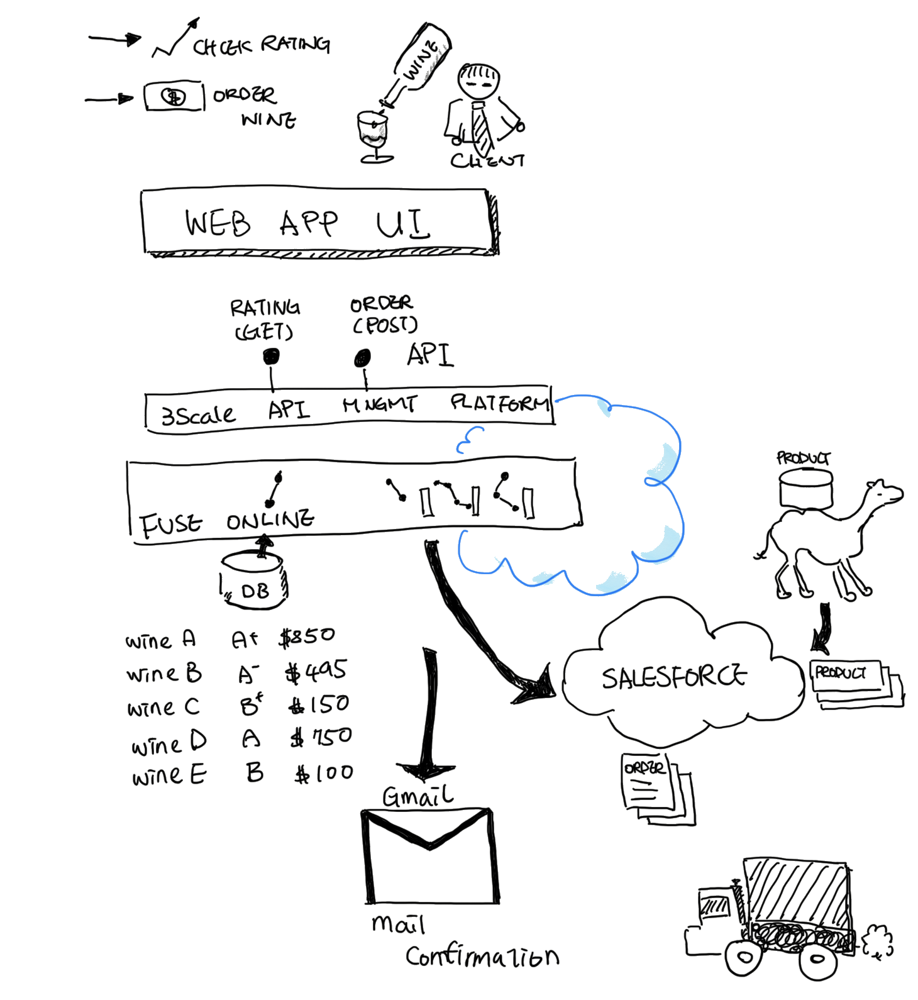

##Red Hat Integration Demo - Full API Life-Cycle

A wine distributor is provide labeling, ranking infomation to their partner via APIs. They already have the system build in Saleforce and internal database. But this new partner the biggest mobile supermarket in the region wanted to have their own data and format and ordering process for their apps. And wanted to have the service ASAP. The wine distributor will need to provide a secured and protected functional API for their client. Let's see how this wine distributor can benefit from using Red Hat Integration.

**Client Wine Application**

This client app allows user to query rating of the wine with their name:


**Overview of the demo**

The wine distributor provides two APIs, 

 - Retreive rating 
 - Wine ordering

The rating is stored in a database, and can be query by the name of the wine. Order are sent to Salesforce and create the account, contract and order according to Salesforce's datastructure. That hides all the Salesforce's  complex integration. Also provide a email notification when order is done. 

Another Fuse application uploads all the wine product into Salesforce for later ordering process. 


*Query Wine Rating*

```
URL:  GET /wine/{name} 

Return Data:
{
	"name":"Proprietary Red, Rutherford",
	"year" : "2013",
	"id" : 42,
	"rating" : "A+"
}
```


*Place order to Salesforce*

```
URL:  POST /order/ 

Request Data:
{
	"name": "Christina",
	"email": "clin@redhat.com",
	"orderwineid" : "1",
	"quantity": 10
}

EMAIL TEMPLATE:

Dear CUSTOMER

Thanks for ordering our wine. 
Your Wine id : XXXX
Quantity: 2
Unit Price: 200

Thank you
```


### Seeing it works

