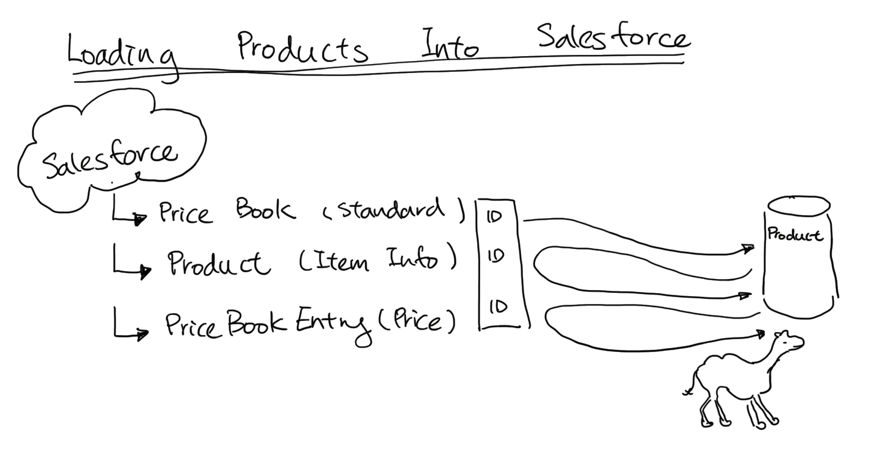

# Fuse Online Wine Demo

This example demonstrates how to load products from Database to Salesforce.

This is part of the my Fuse Online demo. Where it receives the order from an Wine Javascript Application. And updated and add orders to Salesforce. 

### Configure Salesforce Credentials

In your application.properties, add the following config:

	camel.component.salesforce.clientId=
	camel.component.salesforce.clientSecret=
	camel.component.salesforce.userName=
	camel.component.salesforce.password=

### Running locallty

You can run the application with following command:

    mvn spring-boot:run

To load the products into Salesforce

	curl -k http://localhost:8080/wineproduct/addwine

To remove the products from Salesforce

	curl -k http://localhost:8080/wineproduct/deletewine

### Deploying and Running in OpenShift

It is assumed that:
- OpenShift platform is already running, if not you can find details how to [Install OpenShift at your site](https://docs.openshift.com/container-platform/3.3/install_config/index.html).

- Your system is configured for Fabric8 Maven Workflow, if not you can find a [Get Started Guide](https://access.redhat.com/documentation/en/red-hat-jboss-middleware-for-openshift/3/single/red-hat-jboss-fuse-integration-services-20-for-openshift/)

- Installed OpenShift Client locally, and logged into OpenShift

First, create a new namespace:

	oc new-project wine

Import the Fuse image streams:

    oc create -f https://raw.githubusercontent.com/jboss-fuse/application-templates/GA/fis-image-streams.json

Install postgresql Database: 
	
	oc new-app --template=postgresql-ephemeral --param=POSTGRESQL_USER=dbuser --param=POSTGRESQL_PASSWORD=password --param=POSTGRESQL_DATABASE=sampledb

	
Deploying the demo to OpenShift, go to the project directory:

    mvn fabric8:deploy

To list all the running pods:

    oc get pods

Now you can start load and delete products into your salesforce account.
To load the products into Salesforce

	curl -k http://localhost:8080/wineproduct/addwine

To remove the products from Salesforce

	curl -k http://localhost:8080/wineproduct/deletewine

